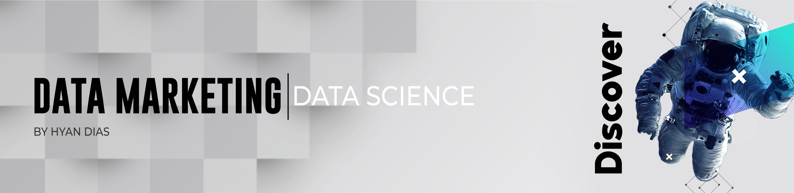

   

  

# Hyan Dias
*Data marketing* at Zero.ai

I'm a Marketing consultant, CEO of Zero.ai, mentor at Programa Nascer, organizer at the Nilo Community and DataScience and Python enthusiasts, besides being a nerd and anime fan.

My motto:
Data are the tools that make it possible to explore creativity in the midst of chaos. And Rebellion is the spirit of courage that overthrows the obsolete.

I am an expert in:
• Strategic marketing
• Business management
• Data Analysis for Business Intelligence

I've been working mainly with startups and companies that seek to accelerate their growth, helping them to build business and marketing strategy (brand building, positioning, digital marketing, social media, content and innovation), in addition to bringing as a culture the making of decision based on data / information.

Among my clients are companies with the most varied profiles:
• Micro companies
• Industry
• Engineering
• E-commerces
• Marketplaces
• Entrepreneurs.

Another aspect in which I am exploring is the universe of data science, as a business strategy, within it are: Deep Learning, Business Intelligence, Predictive Analysis, Campaign Optimization, Automation in Decision Making, Neural Networks, and others.

**Background in:** Python, Data Marketing, statistical and predictive model.

**Links:**
* [Blog](http://zeroai.com.br)
* [LinkedIn](https://www.linkedin.com/in/hyan-dias/)
* [YouTube](https://www.youtube.com/channel/UCpa3EHc_mTr0UVffXo1MU5A)
* [Instagram](https://www.instagram.com/zero.ai.oficial/)

## Projetos:
Veja os tutoriais publicados do zero.ai:

* **Como usar o Histograma para Data Science:** https://bit.ly/2L2cMwy
* **Como Implementar Regressão Linear com Python:** https://bit.ly/2Li5pzY
* **Data Science: Investigando o naufrágio do Titanic:** https://bit.ly/2Ubr5SH
* **Como Tratar Dados Ausentes com Pandas:** https://bit.ly/31KWSMN
* **XGBoost: aprenda este algoritmo de Machine Learning em Python:** https://bit.ly/2UbRhws
* **Como criar uma Wordcloud em Python:** https://bit.ly/2OxsphM
* **Como lidar com dados desbalanceados:** https://bit.ly/2ZlaNsV

---

